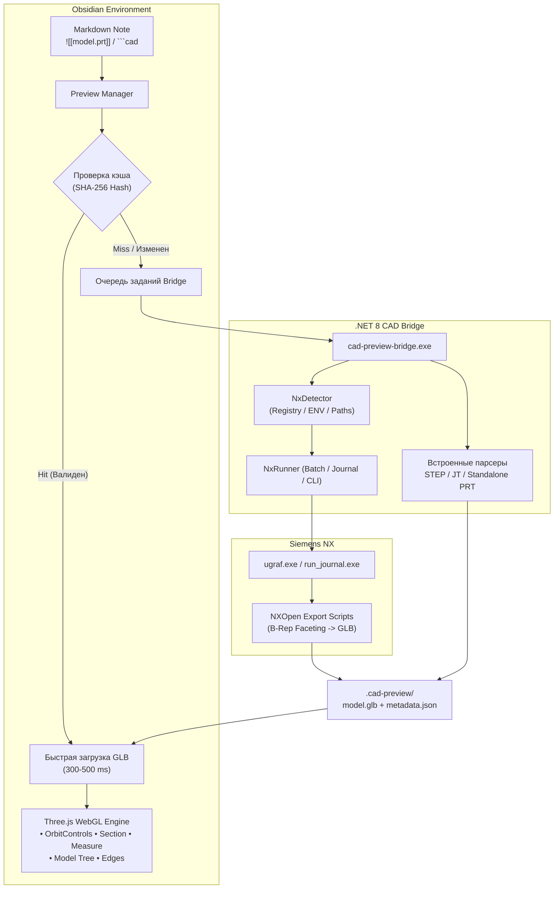

# Obsidian CAD Preview (Siemens NX PRT / STEP / JT)

[](https://obsidian.md)
[](https://threejs.org/)
[](https://dotnet.microsoft.com/)
[](https://www.typescriptlang.org/)
[](LICENSE)

Встроенный высокопроизводительный интерактивный 3D CAD-просмотрщик для заметок **Obsidian**.
Позволяет бесшовно открывать, исследовать и анализировать инженерные модели форматов **Siemens NX (`.prt`)**, **STEP (`.step`, `.stp`)** и **JT (`.jt`)** прямо в Markdown-документах через стандартные ссылки `![[model.prt]]` или специализированные CAD-блоки кода.

---

## 🌟 Ключевые возможности

### 1. Бесшовная интеграция в Obsidian Markdown
- **Стандартный Markdown-синтаксис**: вставка через вики-ссылки `![[Models/Gearbox.prt]]`.
- **Поддержка псевдонимов (alias)**: `![[Models/Assembly.prt|Редуктор узла в сборе]]`.
- **Настройка размеров карточки**: 
  - `![[Assembly.prt|800x500]]`
  - `![[Assembly.prt|width=100%|height=600]]`
  - `![[Assembly.prt|thumbnail]]` (режим компактной миниатюры).
- **Специализированный блок кода ` ```cad `**: тонкое конфигурирование ракурса, проекции, качества и стилей в YAML-подобном формате.
- **Два режима отображения**: бесшовная работа внутри заметок (**Live Preview** и **Reading View**) и открытие 3D-модели в **отдельной вкладке Obsidian** в виде полноэкранного рабочего пространства.

### 2. Интерактивная 3D-сцена (Three.js WebGL)
- **Плавная навигация (OrbitControls)**:
  - Вращение: **Левая кнопка мыши (ЛКМ)**.
  - Панорамирование: **Правая кнопка мыши (ПКМ)** или **Shift + ЛКМ**.
  - Масштабирование: **Колесо мыши**.
  - Автоподгонка (Fit): **Двойной клик** по сцене или кнопка `Fit`.
- **Инженерные стандартные виды**: быстрое переключение камеры в один клик: `ISO` (Изометрия), `FRONT` (Спереди), `BACK` (Сзади), `TOP` (Сверху), `BOTTOM` (Снизу), `LEFT` (Слева), `RIGHT` (Справа).
- **Проекции камеры**: мгновенное переключение между **Ортогональной** (инженерная проекция без перспективных искажений) и **Перспективной**.
- **Стили рендеринга**:
  - *Shaded with Edges* — фотореалистичное затенение с четким акцентированием острых кромок и контуров геометрии.
  - *Shaded* — классический гладкий рендеринг материалов.
  - *Wireframe* — каркасный режим триангуляции.
- **Адаптивная тема**: фон 3D сцены автоматически подстраивается под светлую и темную темы Obsidian.

### 3. Инженерный инструментарий анализа
- **Интерактивное дерево сборки (`ModelTree`)**:
  - Иерархическая структура деталей и тел (Body / Component).
  - Управление видимостью отдельных деталей (👁️ Включить/Скрыть).
  - Режим изоляции деталей (🔍 Изолировать выбранное тело).
  - Двусторонняя синхронизация: выбор узла в дереве подсвечивает деталь на 3D-сцене и наоборот.
- **Выделение и Ghost-режим**: подсветка активной детали ярким акцентом с возможностью полупрозрачного затемнения остальных компонентов сборки.
- **Динамическое сечение (`Section Plane`)**:
  - Рассечение модели плоскостями по осям **X**, **Y**, **Z**.
  - Плавный слайдер положения плоскости рассечения.
  - Кнопка инвертирования вектора нормали сечения.
- **3D-измерение расстояний (`Measurement Tool`)**:
  - Интерактивный клик по 2 точкам на геометрии с привязкой и маркерами.
  - Отрисовка пространственного 3D-отрезка с точным расчетом расстояния в физических единицах модели (например, `45.20 mm`).
- **Инспектор свойств и метаданных**:
  - Габаритные размеры ($X \times Y \times Z$ Bounding Box).
  - Физические свойства (масса, объем, плотность, назначенный материал).
  - Статистика полигонов (количество вершин и треугольников).
- **Быстрый запуск Siemens NX**: кнопка **↗ NX** в верхнем углу для моментального открытия текущей детали или сборки в настольном приложении Siemens NX (`ugraf.exe`).
- **Полноэкранный режим (Full Screen)**: развертывание 3D-сцены на весь монитор.

### 4. Производительность и интеллектуальное кэширование
- **Двухуровневый кэш предпросмотра**:
  - Вычисление уникального SHA-256 хеша от абсолютного пути, размера файла, времени последней модификации (mtime) и настроек качества тесселяции.
  - Время повторного открытия моделей из локального кэша — **300–500 мс**.
- **Фоновый наблюдатель (File Watcher)**: автоматическая перезагрузка и обновление 3D-сцены в Obsidian при сохранении изменений в Siemens NX (с debounce-фильтрацией).
- **Очередь фоновых задач**: предотвращение зависания интерфейса и контроль нагрузки на лицензии и CPU.

---

## 🏛 Архитектура решения



---

## 📋 Синтаксис использования

### 1. Стандартные вставки через вики-ссылки

| Синтаксис | Описание |
|---|---|
| `![[Models/Bracket.prt]]` | Стандартная вставка детали Siemens NX |
| `![[Assembly.prt\|Редуктор]]` | Вставка с отображаемым заголовком |
| `![[Housing.prt\|640x480]]` | Вставка с фиксированными размерами |
| `![[Housing.prt\|width=100%\|height=500]]` | Вставка с процентной шириной и высотой в px |
| `![[Rotor.step\|thumbnail]]` | Режим компактной карточки-миниатюры |
| `![[Machine.jt]]` | Вставка легковесного формата JT |

### 2. Расширенный блок кода ```cad

```cad
file: Models/1 часть кондуктора.prt
width: 100%
height: 550px
view: iso
projection: orthographic
quality: normal
edges: true
theme: auto
```

#### Доступные параметры блока `cad`:
- `file` / `model` / `path`: путь к файлу CAD относительно корня хранилища или абсолютный путь.
- `width`: ширина контейнера (`100%`, `800px` и т.д., по умолчанию `100%`).
- `height`: высота контейнера (`500px`, `400` и т.д., по умолчанию `450px`).
- `view`: начальный ракурс (`iso`, `front`, `back`, `top`, `bottom`, `left`, `right`).
- `projection`: тип проекции (`orthographic` или `perspective`).
- `quality`: качество тесселяции (`draft`, `normal`, `high`, `ultra`).
- `edges`: отображение кромок (`true` / `false`).
- `theme`: цветовая тема фона (`auto`, `dark`, `light`).

---

## ⌨️ Управление 3D-сценой

| Действие | Управление мышью / клавиатурой |
|---|---|
| **Вращение камеры** | Зажать **ЛКМ** + перемещение мыши |
| **Панорамирование (Pan)** | Зажать **ПКМ** или **Shift + ЛКМ** + перемещение мыши |
| **Масштабирование (Zoom)** | **Колесо мыши** |
| **Автоподгонка (Fit All)** | **Двойной клик ЛКМ** по сцене или кнопка `Fit` на панели |
| **Стандартные виды** | Кнопки `ISO`, `FRONT`, `TOP`, `RIGHT` на панели управления |
| **Выделение детали** | Одиночный **клик ЛКМ** по детали |
| **Дерево модели / сборок** | Кнопка **📦** в правом нижнем углу |
| **Свойства и габариты** | Кнопка **ℹ️** в правом нижнем углу |
| **Сечение модели (Section)** | Кнопка **✂️** — выбор плоскости X / Y / Z и слайдер |
| **3D-измерения (Measure)** | Кнопка **📏** — последовательный клик по двум точкам на геометрии |
| **Открыть в Siemens NX** | Кнопка **↗ NX** в правом верхнем углу карточки |
| **Полноэкранный режим** | Кнопка **⛶** в правом верхнем углу карточки |

---

## ⚙️ Конфигурация и настройки плагина

В разделе **Настройки Obsidian → CAD Preview** доступны следующие параметры:

1. **Каталог Siemens NX**:
   - Кнопка **«Автодетекция»**: автоматически находит установленный NX через реестр Windows (`SOFTWARE\Siemens\NX`), переменные среды (`UGII_BASE_DIR`, `NX_DIR`) и стандартные пути `C:\Program Files\Siemens\NX*`.
   - Кнопка **«Проверить NX»**: выполняет тестовый вызов NX для проверки доступности пакетного экспорта.
2. **Качество тесселяции по умолчанию**: выбор между `Draft`, `Normal`, `High`, `Ultra`.
3. **Стандартный вид камеры**: `Isometric`, `Front`, `Top`, `Right`.
4. **Проекция камеры**: `Ортогональная` (рекомендуется для CAD) или `Перспективная`.
5. **Отображение рёбер (Shaded with Edges)**: подчеркивание линий перегиба граней.
6. **Автоматическое обновление**: отслеживание изменений на диске и обновление предпросмотра при сохранении в NX.
7. **Управление кэшем**: отображение общего объема кэша и кнопка полной очистки.
8. **Расширенные параметры (Advanced)**:
   - Таймаут конвертации NX (15–600 сек).
   - Количество параллельных воркеров (по умолчанию 1).
   - Порог предупреждения для высокополигональных моделей.

---

## 💻 Автономная CLI-утилита `cad-preview-bridge`

Модуль моста (.NET 8) может запускаться независимо из терминала для пакетной обработки и автоматизации:

```bash
# Конвертация файла NX PRT / STEP / JT в GLB
cad-preview-bridge convert Assembly.prt --output Assembly.glb --quality normal

# Получение метаданных и физических свойств в формате JSON
cad-preview-bridge inspect Assembly.prt

# Диагностика и поиск установленных версий Siemens NX
cad-preview-bridge test-nx

# Генерация эталонных тестовых CAD-моделей
cad-preview-bridge generate-test-models --output-dir ./models
```

---

## 🛠 Сборка и разработка

### Требования к окружению:
- **Node.js**: версии 18+ и менеджер пакетов `npm`
- **.NET SDK**: версия 8.0+
- **Obsidian**: версия v1.4.0+
- *(Опционально)* Установленный **Siemens NX** (версии NX 11 ... NX 2512+) для работы с нативными закрытыми B-Rep моделями PRT. STEP и JT обрабатываются автономно без внешних зависимостей.

### Шаги сборки:

1. **Клонирование репозитория**:
   ```bash
   git clone https://github.com/Homiakus/obsidian-cad-view.git
   cd obsidian-cad-view
   ```

2. **Установка зависимостей и сборка плагина**:
   ```bash
   npm install
   npm run build
   ```

3. **Сборка .NET Bridge**:
   ```bash
   dotnet publish bridge/CadPreviewBridge/CadPreviewBridge.csproj -c Release -r win-x64 --self-contained false -o bin/bridge
   ```

4. **Запуск автоматических тестов**:
   ```bash
   # Запуск интеграционных тестов плагина
   node tests/plugin-tests.mjs

   # Запуск C# тестов парсеров и экспортера GLB
   dotnet run --project tests/CadPreviewTests/CadPreviewTests.csproj
   ```

---

## 📄 Лицензия

Проект распространяется под открытой лицензией [MIT](LICENSE).
Разработано для сообщества инженеров и пользователей Obsidian.
