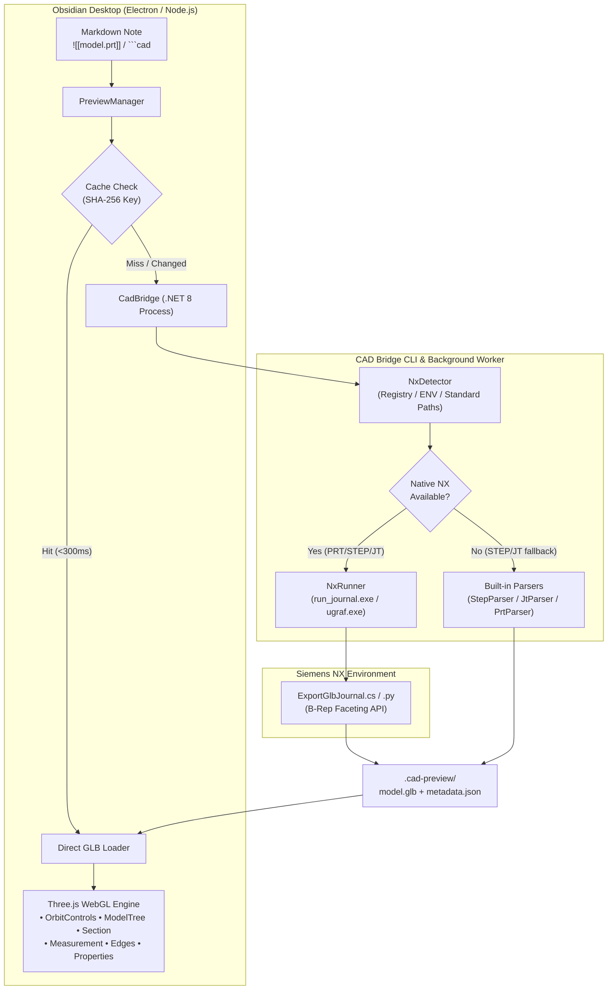

# Obsidian CAD Preview

Interactive 3D CAD viewer for **Siemens NX (`.prt`)**, **STEP (`.step`, `.stp`)**, and **JT (`.jt`)** files directly inside Obsidian notes.

[](https://obsidian.md)
[](https://threejs.org/)
[](https://dotnet.microsoft.com/)
[](https://www.typescriptlang.org/)
[](LICENSE)

---

## ⚡ Quick Start (5 minutes)

### Recommended: Install into Obsidian Vault

1. Download the latest release archive (`obsidian-cad-preview.zip`).
2. Extract the contents into your vault's plugin directory:
   ```text
   <Your-Vault>/.obsidian/plugins/obsidian-cad-preview/
   ├── main.js
   ├── manifest.json
   ├── styles.css
   └── bin/
       └── bridge/
           ├── cad-preview-bridge.exe
           └── NxScripts/
   ```
3. Open **Obsidian → Settings → Community Plugins**, reload plugins, and enable **CAD Preview**.
4. Put any `.prt`, `.step`, or `.jt` file in your vault (e.g., `Models/Bracket.step`).
5. Open any note and insert:
   ```markdown
   ![[Models/Bracket.step]]
   ```
6. The interactive 3D model renders immediately in your note.

---

## 🎯 Why CAD Preview?

Engineers and hardware designers documenting assemblies in Obsidian traditionally had to rely on static 2D screenshots. Every design revision required manual re-exporting, cropping, and re-inserting images.

**Obsidian CAD Preview eliminates this friction:**
- **Live 3D Embedding**: Embed native CAD models with standard Obsidian wiki-links `![[model.prt]]` or customizable ` ```cad ` code blocks.
- **Full Engineering Toolkit**: Inspect assembly trees, isolate parts, cut dynamic section planes, measure 3D point-to-point distances, and inspect physical properties.
- **Fast Local Caching**: Deterministic SHA-256 fingerprinting renders cached models in **under 300 ms**.
- **Bidirectional NX Sync**: Auto-detects local Siemens NX installations (`NX 11` through `NX 2512+`) and updates previews in the background whenever you save in NX.
- **Zero External Dependencies for STEP & JT**: Built-in parsers convert STEP and JT files standalone without needing CAD licenses.

---

## 🚀 Key Features

| Capability | Description |
|---|---|
| **Markdown Integration** | Embed via `![[model.prt]]`, custom dimensions `![[model.prt\|800x500]]`, aliases `![[model.prt\|Gearbox]]`, or `thumbnail` mode. |
| **Interactive 3D Canvas** | Three.js WebGL viewport with OrbitControls, 7 standard engineering views (`ISO`, `FRONT`, `TOP`, `RIGHT`, etc.), and Orthographic/Perspective toggles. |
| **Rendering Modes** | *Shaded with Edges* (sharp edge enhancement), *Shaded*, and *Wireframe*. Theme-aware background matching Obsidian light/dark mode. |
| **Assembly Tree (`ModelTree`)** | Hierarchical component tree with two-way selection sync, visibility toggles (👁️), and part isolation (🔍). |
| **Dynamic Section Plane** | Real-time X/Y/Z cutting planes with position slider and normal flipping. |
| **3D Distance Measurement** | Click two points on geometry to calculate spatial distances in physical model units (mm/in). |
| **Property Inspector** | View bounding boxes ($X \times Y \times Z$), mass, volume, material metadata, and triangle counts. |
| **Desktop NX Integration** | One-click **↗ NX** button to launch the original model directly in Siemens NX (`ugraf.exe`). |

---

## 💻 Usage & Syntax Examples

### 1. Standard Wiki-Link Embeds

```markdown
<!-- Standard full-width embed -->
![[Models/Housing.prt]]

<!-- Embed with alias title -->
![[Models/Assembly.prt|Gearbox Assembly v2]]

<!-- Custom fixed dimensions (Width x Height in px) -->
![[Models/Rotor.step|640x480]]

<!-- Percentage width and explicit height -->
![[Models/Bracket.prt|width=100%|height=550]]

<!-- Compact thumbnail card -->
![[Models/Machine.jt|thumbnail]]
```

### 2. Dedicated ` ```cad ` Code Block

For fine-grained control over camera angle, projection, and quality presets:

````markdown
```cad
file: Models/Assembly.prt
width: 100%
height: 500px
view: iso
projection: orthographic
quality: normal
edges: true
theme: auto
```
````

#### Code Block Parameters:
- `file` / `model` / `path` *(required)*: Relative vault path or absolute path to the CAD file.
- `width` *(optional, default `100%`)*: Container width (`100%`, `800px`, `600`).
- `height` *(optional, default `450px`)*: Container height (`450px`, `500`).
- `view` *(optional, default `iso`)*: Initial camera orientation (`iso`, `front`, `back`, `top`, `bottom`, `left`, `right`).
- `projection` *(optional, default `orthographic`)*: Camera mode (`orthographic` or `perspective`).
- `quality` *(optional, default `normal`)*: Tessellation fidelity (`draft`, `normal`, `high`, `ultra`).
- `edges` *(optional, default `true`)*: Outline sharp feature edges (`true` or `false`).
- `theme` *(optional, default `auto`)*: Viewport background (`auto`, `dark`, `light`).

### 3. Separate Workspace Tab

Clicking any CAD file in the Obsidian file explorer opens a dedicated full-tab 3D workspace leaf (`VIEW_TYPE_CAD`).

---

## 🎮 Viewport Navigation & Controls

| Action | Control |
|---|---|
| **Rotate** | Click & drag **Left Mouse Button (LMB)** |
| **Pan** | Click & drag **Right Mouse Button (RMB)** or **Shift + LMB** |
| **Zoom** | **Mouse Wheel** scroll |
| **Fit to View** | **Double-click** canvas or click `Fit` button on toolbar |
| **Standard Views** | Click `ISO`, `FRONT`, `TOP`, `RIGHT` on the bottom toolbar |
| **Select Part** | **Click (LMB)** directly on any 3D component |
| **Assembly Tree** | Click **📦** icon in bottom-right corner |
| **Model Properties** | Click **ℹ️** icon in bottom-right corner |
| **Section Plane** | Click **✂️** icon → select axis (X/Y/Z) and adjust slider |
| **Measure Distance** | Click **📏** icon → click Point 1, then click Point 2 on model surfaces |
| **Open in Siemens NX** | Click **↗ NX** icon in top-right header |
| **Fullscreen** | Click **⛶** icon in top-right header |

---

## ⚙️ Plugin Configuration

Configurable via **Obsidian Settings → CAD Preview**:

| Setting | Default | Description |
|---|---|---|
| **Siemens NX Directory** | Auto-detected | Base directory of Siemens NX (e.g. `C:\Program Files\Siemens\NX2512`). Includes **Auto-detect** and **Test NX** buttons. |
| **Tessellation Quality** | `normal` | Default mesh resolution (`draft`, `normal`, `high`, `ultra`). |
| **Default Camera View** | `iso` | Initial orientation on load (`iso`, `front`, `top`, `right`). |
| **Camera Projection** | `orthographic` | `orthographic` (engineering CAD standard) or `perspective`. |
| **Show Edges** | `true` | Enhances boundary and crease edges on geometry. |
| **Auto Update** | `true` | Watches CAD files and refreshes previews when modified in external CAD tools. |
| **Cache Management** | — | Displays total cache disk usage with one-click **Clear Cache** action. |
| **Conversion Timeout** | `120s` | Maximum execution time allowed for external NX batch exporter (15–600s). |
| **Max Concurrent Workers**| `1` | Number of simultaneous background conversion processes. |
| **Triangle Warning Threshold** | `500000` | Polycount limit before displaying performance advisory on complex models. |

---

## 🛠 Standalone CLI Tool: `cad-preview-bridge`

The `.NET 8` bridge executable (`bin/bridge/cad-preview-bridge.exe`) can be used independently for batch processing, automated pipelines, or headless conversion:

```powershell
# Convert CAD file to GLB
cad-preview-bridge convert Assembly.prt --output Assembly.glb --quality normal

# Inspect CAD file metadata
cad-preview-bridge inspect Housing.prt

# Detect installed Siemens NX installations
cad-preview-bridge test-nx

# Generate synthetic reference models for testing
cad-preview-bridge generate-test-models --outdir ./models
```

---

## 🏗 Architecture



---

## 📋 System Requirements & Compatibility

### Host Requirements
- **Operating System**: Windows 10 / 11 (64-bit).
- **Obsidian**: v1.4.0 or newer (Desktop).
- **Runtime**: [.NET 8.0 Desktop Runtime](https://dotnet.microsoft.com/download/dotnet/8.0) (x64).

### Supported CAD Formats & Software Matrix

| Format | Standalone Mode | Siemens NX Integration | Status |
|---|---|---|---|
| **STEP (`.step`, `.stp`)** | ✅ Full support (ISO 10303-21) | ✅ Direct import / export | Verified |
| **JT (`.jt`)** | ✅ Full support (ISO 14306) | ✅ Direct import / export | Verified |
| **Siemens NX (`.prt`)** | ⚠️ Metadata & synthetic fallback | ✅ Full B-Rep tessellation & assembly structure | Verified (NX 11 – NX 2512+) |

---

## 🔨 Building from Source

### Prerequisites
- [Node.js](https://nodejs.org/) (v18+) & `npm`
- [.NET 8.0 SDK](https://dotnet.microsoft.com/download/dotnet/8.0)

### 1. Build Obsidian Plugin
```powershell
# Clone the repository
git clone https://github.com/Homiakus/obsidian-cad-view.git
cd obsidian-cad-view

# Install dependencies and build JS bundle
npm install
npm run build
```

### 2. Build .NET Bridge
```powershell
dotnet publish bridge/CadPreviewBridge/CadPreviewBridge.csproj `
  -c Release `
  -r win-x64 `
  --self-contained false `
  -o bin/bridge
```

### 3. Run Automated Tests
```powershell
# Run JavaScript plugin integration tests (18 tests)
node tests/plugin-tests.mjs

# Run .NET geometry, tessellation, and transform test suite (43 tests)
dotnet run --project tests/CadPreviewTests/CadPreviewTests.csproj
```

---

## ❓ Troubleshooting

### 1. "Siemens NX not detected"
- **Cause**: Siemens NX is installed in a non-standard directory or environment variables are missing.
- **Fix**: Open **Obsidian Settings → CAD Preview**, and enter your NX path manually (e.g. `C:\Program Files\Siemens\NX2512`), then click **Проверить NX** (Test NX).

### 2. "CAD Bridge executable not found"
- **Cause**: The `bin/bridge/cad-preview-bridge.exe` file is missing from the plugin folder.
- **Fix**: Ensure the `bin/` directory from the release archive was extracted alongside `main.js` and `manifest.json`.

### 3. "Model displays as wireframe or white box"
- **Cause**: Outdated graphics drivers or WebGL hardware acceleration disabled in Obsidian.
- **Fix**: Verify WebGL is enabled in your GPU driver settings, and try toggling the projection mode (`Orthographic` vs `Perspective`).

---

## 📄 License

This project is licensed under the [MIT License](LICENSE).
Developed for the engineering and knowledge management community.
